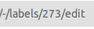
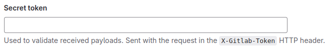

Configuration
=============

Config file
-----------

All config information must be added to ``.gitlab-config.yml`` file. The file must be located
in root django project directory (same as defined in ``settings.BASE_DIR``) and it is **required**
so that anything works. In the file one has to include such information as url to the GitLab site,
project id, api token, labels names/ids etc. All possible options (some are required, some optional)
with example usages you can find below.

connection
----------

**Required**: ``true``
**Type**: ``object``

``connection`` object defines some essential information that are needed to connect with appropriate
Gitlab instance and use appropriate project there. Inside ``connection`` one can include such options:

url
~~~

**Required**: ``true``
**Type**: ``string``

Url to the Gitlab instance. For example: ``"https://gitlab.com"``

project_id
~~~~~~~~~~

**Required**: ``true``
**Type**: ``integer``

Id of the Gitlab project you're currently working on. It is usually displayed in the project main page.

private_token
~~~~~~~~~~~~~

**Required**: ``true``
**Type**: ``string`` or ``object``

Project access token that will be used to authenticate to GitLab. You can add one in *Settings >> Access Tokens*.
Select ``api`` as a scope to grant access to api.

There are 2 ways of defining it. You can either type it directly as a string or (using ``env`` keyword)
give the environment variable name that will hold the token. The second way is the recommended one.

**Examples**:

.. code-block:: yaml

    private_token: "project_access_token"

    # Recommended
    private_token:
        env: "GITLAB_PROJECT_TOKEN"

api_version
~~~~~~~~~~~

**Required**: ``false``
**Default**: ``4``
**Type**: ``string``

Api version used by GitLab.

timeout
~~~~~~~

**Required**: ``false``
**Default**: ``10``
**Type**: ``integer``

Maximal number of seconds the application will wait until GitLab response.

ssl_verify
~~~~~~~~~~

**Required**: ``false``
**Default**: ``true``
**Type**: ``bool``

Whether SSL certificates should be validated.

Example configuration
~~~~~~~~~~~~~~~~~~~~~

.. code-block:: yaml

    connection:
        url: "https://gitlab.com"
        project_id: 123
        private_token:
            env: "GITLAB_PROJECT_TOKEN"
        api_version: "4"
        timeout: 20
        ssl_verify: true

labels
------

**Required**: ``true``
**Type**: ``object``

``labels`` object defines **ids** or **names** of labels used in your project. Keys in this object
are actually roles that play given labels. Although it is easier for the user to find a label by name,
it is recommended to use ids as changing the name doesn't affect the config file - only deleting a
label does.

**How to find a label id?**
The easiest way is to edit a label and find its id in the url.

You can also obtain labels ids using GitLab api but it is a little bit more complicated.
Check `Gitlab api docs <https://docs.gitlab.com/ee/api/labels.html#list-labels>`_ for reference.

Possible labels keys:

to_do
~~~~~

**Required**: ``true``
**Type**: ``string`` or ``integer``

Tasks that have to be done in nearest future.

in_progress
~~~~~~~~~~~

**Required**: ``true``
**Type**: ``string`` or ``integer``

Tasks that are currently being done by someone.

in_review
~~~~~~~~~

**Required**: ``true``
**Type**: ``string`` or ``integer``

Tasks that are waiting for code review. When a merge request is created, all tasks that are related to
it, obtain this label automatically.

merged
~~~~~~

**Required**: ``true``
**Type**: ``string`` or ``integer``

Label automatically added to tasks when a merge request related to them is merged.
Additionally, such tasks obtain ``{target branch name} branch`` to mark where things
connected with these tasks were merged. When 2 protected branches are merged in a merge
request, it also takes place so that some tasks can have multiple such labels.

On the one hand, it makes it easier to follow issues and, on the other hand, in the
future it might help with handling deployments labels as the next feature of **django-auto-gitlab**.

backend
~~~~~~~

**Required**: ``false``
**Type**: ``string`` or ``integer``

Tasks that are related to the backend side. If defined, all issues with names containing
``[BACKEND]`` (by default, it can be overriden - check :ref:`issue_identifiers`) get this label by creation.

frontend
~~~~~~~~

**Required**: ``false``
**Type**: ``string`` or ``integer``

Tasks that are related to the frontend side. If defined, all issues with names containing
``[FRONTEND]`` (by default, it can be overriden - check :ref:`issue_identifiers`) get this label by creation.

bug
~~~

**Required**: ``false``
**Type**: ``string`` or ``integer``

Tasks that are bugs. If defined, all issues with names containing
``[BUG]`` (by default, it can be overriden - check :ref:`issue_identifiers`) get this label by creation.

Example configuration
~~~~~~~~~~~~~~~~~~~~~

.. code-block:: yaml

    labels:
        to_do: "To do"
        in_progress: "In progress"
        in_review: "CR"
        merged: 1
        backend: 2
        frontend: 3
        bug: 4

secret_token
------------

**Required**: ``false``
**Type**: ``string`` or ``object``

Token that will be included in every request sent to url defined by **django-auto-gitlab**.

As in the case of :ref:`private_token` it can be just a string or the name of environment variable
that will hold it.

**Examples**:

.. code-block:: yaml

    secret_token: "my_very_secret_token"

    # Recommended
    secret_token:
        env: "GITLAB_SECRET_TOKEN"

patterns
--------

**Required**: ``false``
**Type**: ``object``

The object that allows the user to define some regular expressions depending on the needs.
At the moment one can add 3 keys:

issues_source_branch
~~~~~~~~~~~~~~~~~~~~

**Required**: ``false``
**Default**: ``(\d+)``
**Type**: ``string``

The regular expression describing the way of capturing issues iids in a source
branch name when merging it into a target branch using a merge request. By default
it captures all numbers groups. It is a fallback to the description of a merge request, i.e.
first the issues marked in the description (by using # + number) are checked and if there
are no issues found, the source branch name is checked in order to move appropriate issues.

.. note::

   Normal python regular expressions are expected. To be sure they will be interpreted well
   one should omit ``"`` in the yaml file and the way of writing them is the same as in python
   using ``r`` before string.

**Example**

.. code-block:: yaml

    issues_source_branch: (\d+)

merge_protected_branches
~~~~~~~~~~~~~~~~~~~~~~~~

**Required**: ``false``
**Default**: ``merge/(.+?)_to``
**Type**: ``string``

The regular expression describing the way of capturing the protected branch name if
the source branch was created from the protected one. It helps detect merge of 2
protected branches if the source branch has another name and was created only for
the merge request. Thanks to it, appropriate tasks will receive a suitable label.
It might be helpful in the future when deployments will be handled.

.. note::

    If 2 protected branches are directly merged, there's no problem and issues
    will receive suitable labels anyway.

issue_identifiers
~~~~~~~~~~~~~~~~~

**Required**: ``false``
**Type**: ``list``

The last key of ``patterns`` object defines which labels should be automatically added
to the issue that has been created based on its name. Example identifier can be: all issues
with ``[BACKEND]`` in the name should receive ``backend`` label.

Every element in the ``issue_identifiers`` list is the object with 3 properties (all are required):

**name**

**Type**: ``string``

The string that identifies the rule. It can be any name - it's up to you. (There is one exception
described below)

**label**

**Type**: ``string`` or ``integer``

The label that should be added to the created issue.

**pattern**

**Type**: ``string`` or ``integer``

The pattern that must be checked to decide if the issue should receive given label.

**Warning**

*Default* ``issue_identifiers`` look like this:

.. code-block:: yaml

    issue_identifiers:
        - name: "bug"
          label: "bug" # label you defined in labels section
          pattern: \[BUG\]
        - name: "backend"
          label: "backend" # label you defined in labels section
          pattern: \[BACKEND\]
        - name: "frontend"
          label: "frontend" # label you defined in labels section
          pattern: \[FRONTEND\]

These defaults are applied if you defined ``bug``, ``backend``, ``frontend`` labels
for each label apart. If you want to **override** pattern or label for the rule, you
need to give exactly the same name as you see above (``bug``, ``backend`` or ``frontend``).
Of course, you can define as many own rules as you need.

.. note::

    For your own rules you can add any label - it doesn't have to be present in labels object.

Example configuration
~~~~~~~~~~~~~~~~~~~~~

.. code-block:: yaml

    patterns:
        issues_source_branch: (\d+)
        merge_protected_branches: merge/(.+?)_to
        issue_identifiers:
            - name: "backend"
              label: "custom_backend_label"
              pattern: \[BACKEND\]
            - name: "what you want"
              label: "something"
              pattern: "{SOMETHING}"
