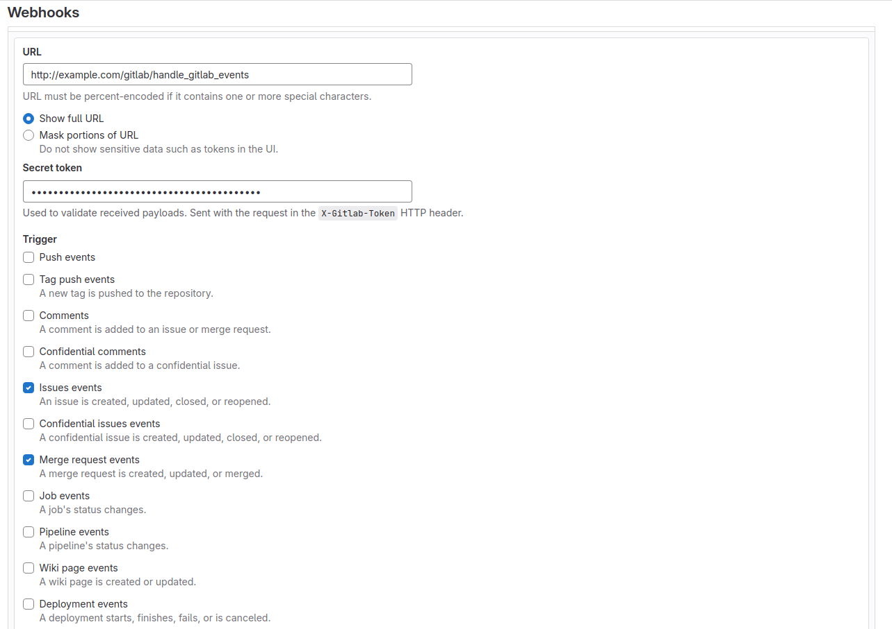

Usage
=====

Creating a config file
----------------------

First step after :ref:`Installation` is to configure your GitLab connection, labels
etc. Here you can find instructions how to do it: :ref:`Configuration`.

Including urls in `urls.py`
--------------------------

Next, you have to include a url that will handle gitlab events and then will
be added to webhooks on GitLab site. You can do it by including `auto_gitlab.urls`
in your `urls.py` file for example like this:

.. code-block:: python

    urlpatterns = [
        "...",
        path("gitlab/", include("auto_gitlab.urls")),
        "...",
    ]

At the moment it will add such a url (in the future there might be more):
`your_domain/gitlab/handle_gitlab_events`.

.. note::

    You can also choose your own url name - just use `GitlabWebhookAPIView` from `auto_gitlab.views`.

Recommended way, of course, is to include such a url only during development so you
can check some environment variable (for example DEV or even if gitlab api token variable
is defined) and then include the url.

.. code-block:: python

    if settings.DEV: # settings.GITLAB_API_TOKEN or whatever name you've chosen
        urlpatterns += [path("gitlab/", include("auto_gitlab.urls"))]

Adding your webhook url to GitLab
---------------------------------

This is the final step. Go to your project in GitLab, then *Settings >> Webhooks >> Add new webhook*.
Enter your url and a secret token (if you have one it **must** be the same you added in your
config file). Check *Issues events* and *Merge request events* and click *Add webhook*. Now
your work with GitLab labels should be a little bit more automated :).

